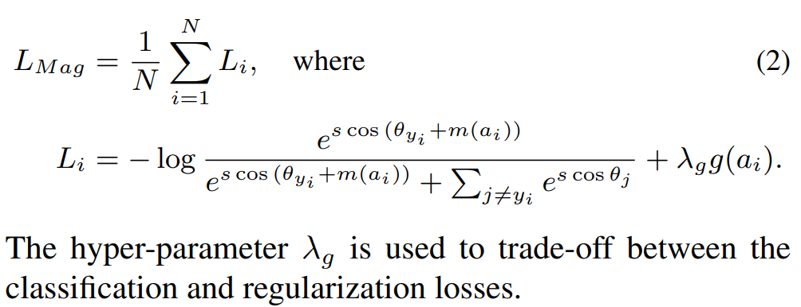
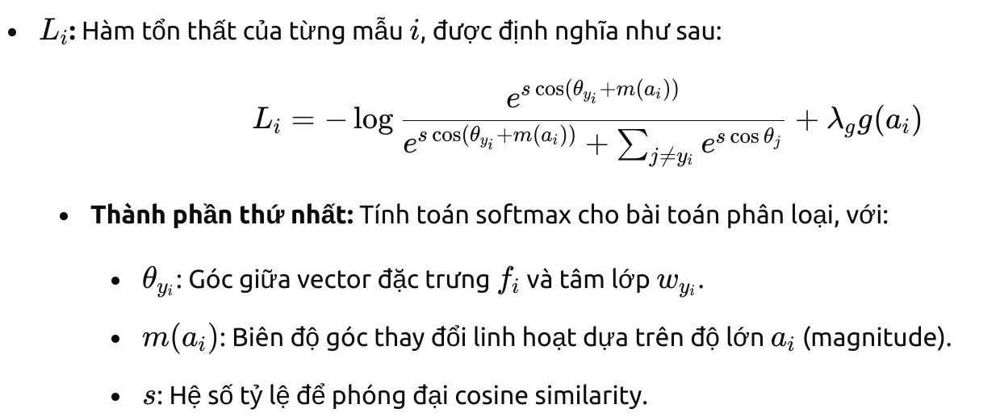
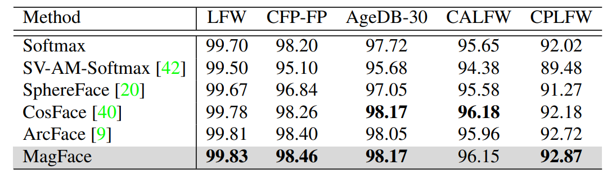
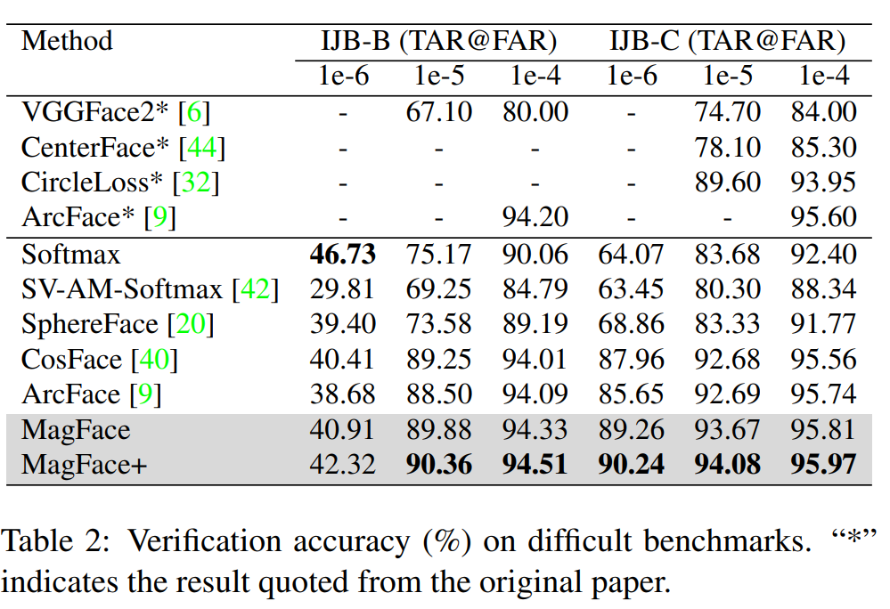

# Abstract

0. Vấn đề:
- Các hệ thống Face Recognition luôn gặp phải vấn đề suy giảm hiệu suất trong môi trường tự nhiên khi sắc thái khuôn mặt như biểu cảm, tư thế thay đổi hay các yếu tố ngoại cảnh như ánh sáng, ... Nói chung là chất lượng dữ liệu không đồng đều. Các phương pháp trước tập trung xử lý vấn đề này ở bước pre-processing để cung cấp thêm thông tin chất lượng hình ảnh và các đặc điểm khuôn mặt (multi task learning)
1. Đóng góp:
- Đề xuất MagFace loss để model có thể học được 1 universal feature embedding mà có thể đo lường lường được độ lớn của chất lượng hình ảnh.
- Có cơ chế adaptive learning để tổ chức các embedding trong 1 class tốt hơn bằng cách kéo các easy sample về phía trung tâm của class và đẩy các hard sample ra xa khỏi class. Điều này giúp mô hình tránh overfitting trên noise low-quality sample và cải thiện hiệu suất nhận diện trong thực tế.
- Các thí nghiệm liên quan đến khả năng phân cụm cho thấy tính ưu việt vượt trội so với state-of-the-arts cùng thời.

# 1. Introduction
- Vấn đề face recognition khó khăn:
    - illumination, background, blurriness (mờ), low resolution
    - factor trên chính khuôn mặt: pose, occlusion (sự che khuất) và expression (biểu cảm)
    - bias (sự thiên vị) của hệ thống nhận dạng
- Để đối phó với những thách thức trên, đa phần các hệ thống face analysis triển khai 3 stage:

1. **Face acquision**: thu thập 1 set raw image từ video stream (đây là giải pháp khả thi nhất trong thực tế được triển khai)
2. **Feature extraction**: extract disciminative representation (đặc điểm nhận dạng) từ mỗi ảnh
3. **Facial application - Ứng dụng nhận diện khuôn mặt**: so khớp embedding với 1 tập hợp ảnh gallery để tìm kiếm ảnh trong tập cùng thuộc người đó hoặc trong phân cụm ngay trong chính class người đó xem ảnh đó thuộc cụm nào trong class này.

- Để đạt được hiệu suất cao ở giai đoạn thứ 2, rất nhiều các phương pháp đã được đề xuất trong những năm gần đây tiêu biểu như:
    - metric learning và classification loss: học cách biểu diễn từng embedding trích xuất được của khuôn mặt thành 1 điểm trong latent space (không gian tiềm ẩn) bất kể phương sai vốn có trong khuôn mặt. Tuy nhiên trong thực tế, các hình ảnh chất lượng thấp hoặc có large-pose tồn tại rộng rãi. Dẫn đến phần lớn các facial features không rõ ràng hoặc không có. => Nhận dạng sai => Hiệu suất các công nghệ này từ IJB-C khi chuyển sang LFW rất thấp.
        
    - margin loss: không nói
    - Các phương pháp trước đó chủ yếu đề cập **biểu diễn embedding dưới dạng 1 điểm** (trong khi magface là vector) trong không gian latent space và phân phối theo Gauss. Và mean của phân phối ước tính giá trị feature có khả năng xảy ra cao nhất trong khi phương sai cho thấy sự không chắc chắn trong các giá trị điểm.

**MagFace được nhóm tác giả đề xuất để học 1 không gian biểu diễn các feature và có nhận thức về quality. Thiết kế của magface tuân theo 2 nguyên tắc.**
    - Với các image cùng 1 identity nhưng ở các mức chất lượng khác nhau như hình 1a - easy sample. Nó tìm cách phân phối các mẫu này trong lớp identity sao cho nó ở gần chung tâm nhất, trong khi low quality nằm phân phối xung quanh biên của class (boundary).
    - Chi phí tối thiểu để tích hợp vào các hệ thống nhận diện đã có mà không cần thay đổi đáng kể kiến trúc hoặc quá trình inference để đo lường quality.
        - Các phương pháp khác thường yêu cầu thêm mạng hoặc khối tính toán mới để đo lường chất lượng khuôn mặt. MagFace tận dụng vector đặc trưng đã được tính toán để đồng thời đánh giá chất lượng, giảm bớt chi phí tính toán.

- Ý tưởng: Để đạt 2 mục tiêu trên họ 
    **- Chọn magnitude (độ lớn của vector hình 1b), thuộc tính độc lập với direction (hướng biểu thị góc tạo với gốc tọa độ) of feature vector làm tiêu chí đánh giá quality.**
    **- Không chỉ làm tăng margin giữa các identity class mà còn duy trì cấu trúc hình nón trong mỗi class như hình 1b.**
        **Để ý góc cos ở các mẫu khó -mơ hồ được đẩy xa khỏi center và gần với orgin (gốc tọa độ O) sẽ to hơn so với các mẫu gần => Ý nghĩa của hình nón.**

- Cách thực hiện: adaptive down-weighting các ambiguous sample trong quá trình training và thưởng cho các feature vector có large magnitude lớn được tính toán bởi Mag loss. Tóm lại Magface cải thiện ở 2 khía cạnh.
    - Đầu tiên MagFace khám phá hoàn chỉnh 2 thuộc tính của feature vector là direction (hướng) và magnitude (độ lớn). Nhiều bài báo trước bỏ qua tầm quan trọng của magnitude bằng cách normalize feature vector. Bằng thực nghiệm và toán học họ đã chứng minh được rằng độ lớn có thể tiết lộ chất lượng của khuôn mặt và có thể được kết hợp với các đặc điểm của nhận dạng mà không cần bất kỳ label nào về chất lượng.
    - Phân phối rõ ràng các feature theo cấu trúc hướng góc (nón ở hình 1b) bằng cách dynamic xác định biên độ góc margin dựa trên hard sample. Ngăn mô hình overfit với các mẫu noisy và low-quality và học cách biểu diễn cấu trúc phân phối phù hợp hơn cho mục đích nhận dạng và phân cụm (mặt chưa gán nhãn).

# 2. Related Work - Các công trình liên quan

Phần này thường trình bày tổng quan về các công trình, phương pháp hoặc nghiên cứu **trước đây** có **liên quan đến chủ đề của bài báo**. 
    - Mục đích đặt bối cảnh cho nghiên cứu mới của tác giả bằng cách giải thích các công trình nghiên cứu trước đây và kết quả đạt được, hạn chế của nó và so sánh với giải pháp của họ.
    - Giúp độc giả hiểu rõ nghiên cứu của bài báo nằm ở đâu trong lĩnh vực rộng lớn đề cập

## 2.1. Face Recognition

Vài năm gần đây chứng kiến sự đột phá của deep convolution trong lĩnh vực face recognition. 1 loạt các hệ thống FR thành công ra đời như DeepFace, DeepID, FaceNet đạt được hiệu suất Face Verification và Face Identity cao.

Ngoài sự phát triển của training data và network architech, 1 sự phát triển mới đã trở thành trend là cải thiện loss func. Hầu hết các công trình nghiên cứu trước đây đều dựa vào metric learning như **contrastive loss, triplet loss, npair loss, angular loss** và không đạt được hiệu quả trong quá trình training embedding hoặc với dataset lớn.

Để cải thiện
- Wen et al. [44]: giới thiệu center loss để học vị trí center cho mỗi identity class để cải thiện tính chặt trẽ intra-class
- L2-softmax [25] và NormFace [39] nghiên cứu sự cần thiết của hoạt động normalize và áp dụng L2 normalization lên cả feature và weights. Từ đó trở đi 1 số angular margin base loss bắt đầu ra đời như dưới
- SphereFace [20], AM-softmax [38], SV-AM-Softmax [42], CosFace [40], ArcFace [9] ra đời áp dụng angular margin base loss cải thiện đần benchmarks với ở level cao hơn.
- AdaptiveFace [19], AdaCos [49] and FairLoss [18] giới thiệu chiến lược adaptive margin để tự động điều chỉnh tham số và giám sát hiệu quả hơn trong quá trình training.
=> Tất cả các phương pháp trên đều chuẩn hóa magnitude của feature vector.

## 2.1. Face Quality Assessment (đánh giá quality của face image)

Là yếu tố then chốt để các hệ thông FR cho ra hiệu suất cao. 

Các phương pháp truyền thống (bằng tay) xem xét quality của face image như ISO/IEC 19794-5 standard [1], ICAO9303 standard [2], Brisque [31], Niqe [23] and Piqe [37

Các phương pháp dựa trên học tập: aceQNet [15] and Best-Rowden [4] dựa trên label do con người đánh giá và dựa trên sự tương đồng giữa chúng. Tuy nhiên, các nhãn chất lượng này dễ bị lỗi vì con người có thể không biết các đặc điểm tốt nhất cho hệ thống nhận dạng và do đó không thể xem xét tất cả các yếu tố thích hợp.

Các phương pháp dựa trên sự không chắc chắn của feature được đề xuất: SER-FIQ [36]. Các phương pháp nhận dạng khuôn mặt có nhận thức về sự tin cậy [29, 7] đề xuất biểu diễn từng hình ảnh khuôn mặt dưới dạng phân phối Gaussian trong không gian tiềm ẩn và tìm hiểu
sự không chắc chắn trong các giá trị đặc điểm. Các phương pháp này hoạt động theo cách học không giám sát như phương pháp MagFace nhưng cần thêm chi phí tính toán hoặc khối mạng, làm phức tạp việc sử dụng hệ thống nhận diện khuôn mặt.

## 2.3. Face Clustering

Phân cụm khuôn mặt để khai thác, khám phá dữ liệu không có label thành các pseudo classed (lớp giả).

Phân cụm truyền thống như K-means [21]

Phân cụm phâp cấp DBSCAN [11]

Phân cụm dựa trên graph covolution network (GCN) được đề xuất gần đây như: LGCN [43], Yang et al. [46] kết hợp 2 mạng GNC là GCN-V and GCN-E để ước tính độ tin cậy của các đỉnh và khả năng kết nối các cạnh tương ứng.

=> MagFace hướng đến cải feature distribution stureture để phục vụ việc clustering.

# 3. Methodology (Phương pháp)

Dựa trên ArcFace, 1 hàm loss phổ biến được sử dụng cho vấn đề FR để đưa ra mục tiêu và chứng minh các thuộc tính cho MagFace. Cuối cùng tiến hành so sánh softmax, arcface và magface theo khía cạnh feature magnitude.

## 3.1. ArcFace Revisited (Xem xét lại MagFace)

ArcFace là lựa chọn được áp dung phổ biến nhất vì dễ triển khai, hiệu suất tiên tiến trên 1 số chuẩn mực.

Giả sử **1 training batch có N face sample {fi, yi} ***
    - **i chạy từ 1 đến N -số identity=batch_size**, 
    - fi thuộc R^d (không gian có d dimention hay embedding có độ dài d được tính toán ở lớp fully connected layer).
    - yi là label tương ứng của lớp feature.
Arcface và các biến thể khác của softmax loss thường tối ưu biểu diễn feature embedding trên 1 hypershere mainfold (siêu cầu đa tạp).
    Hypersphere: 
        Là một mở rộng của khái niệm hình cầu trong không gian nhiều chiều.
        Hình tròn là hypersphere trong 2D (đường tròn). Hình cầu trong 3D (như quả bóng) là hypersphere trong 3 chiều.
        Trong không gian n-chiều, hypersphere là tập hợp tất cả các điểm cách đều tâm một khoảng cố định.
    Manifold (đa tạp):
        Là một không gian hình học, trong đó các điểm gần nhau có thể được biểu diễn như một không gian Euclid (phẳng).
        Hypersphere manifold là một đa tạp trên hypersphere, nơi vector đặc trưng được giới hạn để nằm trên bề mặt của siêu cầu.
Arcface định nghĩa góc **θj = (embedding fi, vector tâm lớp wj)**
    
    

    m là 
    s là hệ số tỷ lệ: để phóng đại (scale) giá trị của cosine similarity khi tính toán tổn thất (loss)
        Giá trị cosine similarity (cosθ) nằm trong khoảng [−1,1], và sự khác biệt giữa các lớp có thể nhỏ, đặc biệt khi dữ liệu có chất lượng thấp hoặc khó phân biệt.
        s được sử dụng để mở rộng giá trị của cosθ, giúp làm nổi bật sự khác biệt giữa các lớp khi tính toán softmax. Điều này làm cho quá trình học trở nên hiệu quả hơn.
        s thường được chọn là 64 trong thực nghiệm
Arcface đã có hiệu suất vượt trội trong việc phân loại intra-class. Nhưng hình phạt dành cho m không phụ thuộc vào chất lượng của ảnh, dẫn đến cấu trúc class thu được là tùy ý trong mọi kịch bản của face image. Minh họa hình 2a:
    

    W và W' : Tâm của hai lớp (class centers) tương ứng.
    B và B′ : Các ranh giới quyết định (decision boundaries) của hai lớp, được phân cách bởi biên độ góc m (additive angular margin).
    Các vòng tròn 1, 2, 3: Đại diện cho các mẫu từ lớp W với chất lượng ảnh giảm dần
        quality được chỉ ra bởi kích thước vòng tròn, vòng tròn càng to thì feature representation càng không chắc chắn và khuôn mặt càng khó nhận dạng.
        Ba loại mẫu có thể ở vị trí tùy ý trong không phần background màu hồng. => Phân phối không ổn định ngay trong lớp.
    Lý do: Arcface sử dụng uniform margin m nên mỗi ảnh trong cùng 1 class có chung 1 decision boundary hay cos(θ+m) = cos(θ) đối với lớp lân cận.
        mặt có chất lượng cao như vòng tròn 1 có thể nằm ở boundary trong khi các ảnh có chật lượng thấp có thể nằm gần trung tâm w hơn như hình 1a (gần hay không nhìn theo vector w và góc hợp với vecto này). Noise và các mẫu hard được đánh giá quá cao có thể gây overfit với chúng. 

## 3.2. MagFace

Dựa trên phân tích trên, có thể thấy các phương pháp cosine-similarity base loss thiếu chi tiết ràng buộc (chỉ có margin m cố định). Điều này dẫn đến struture within-class thu được thiểu ổn định với các kịch bản không bị ràng buộc (như chất lượng ảnh hình 2a khi độ biến thiên của khuôn mặt là rất lớn)

Không giống như các phương pháp trước đây đòi hỏi thêm thuật ngữ uncertainty (không chắc chắn), MagFace tối ưu chất lượng hình ảnh thông qua magnitude của feature image **ai = ||fi||** => Không normalize feature vector fi.

....Vấn là nói về cosine-base metric và độ lớn + direction biểu thị chất lượng của image ... (là công trình đầu tiên nghiên cứu về vấn đề độ lớn feature vector)

Trước khi đi vào công thức, cần hiểu 2 khái niệm

1. **magnitude-aware angular margin m(ai)**: nhận biết angular maigin
    m(ai) tuân theo trực giác tự nhiên: **high quality sample xi** nên tập trung ở 1 vùng nhỏ xung quanh trung tâm cụm W. 
    Bằng cách giả định mối tương quan giữa độ lớn của feature vector và quality của sample mà họ tiến hành phạt xi nếu ai của nó lớn.
    **Điều này được visualize bởi ảnh 2b.**: margin m(ai) tương ứng với các giá trị độ lớn khác nhau, ngược lại với arcface ở hình 2a.
        feasible region (vùng khả thi) được định nghĩa bởi m(ai) hẹp hơn so với arcface và hướng về phía trung tâm class W khi magnitude của feature vector lớn.
        Bounding này kéo các mẫu low-quality sample (vòng tròn 2 và 3) về gốc, nơi chúng có ít nguy cơ bị phạt hơn.
        Tuy nhiên struture được hình thành bởi m(ai) không ổn định với các mẫu chất lượng cao như hình tròn 1: nó vẫn tự do di chuyển trong feasible region.
2. **regularizer g(ai)**: Bộ điều chỉnh ai (**ai = ||fi||**)
    Được giới thiệu để khắc phục circle 1 tự do di chuyển trong feasible region.
    Thưởng (reward) cho các mẫu có ai lớn (chất lượng cao), khuyến khích chúng nằm gần tâm lớp w.
    g(ai) được thiết kế là 1 hàm lồi đơn điệu theo ai để đảm bảo các mẫu chất lượng cao bị kéo mạnh hơn về tâm lớp. => Tóm lại magface thêm hàm này so với công thức của arcface.
    Két quả thu được của arcface được visualize bởi hình 2d

MagFace loss công thức:
    

    Lmag là loss thu được trên toàn bộ batch, trong đó N là mini-batch hay số lượng sample trong mỗi batch và Li là loss của mỗi mẫu.

    Trong Li:
        - Thành phần 1: Là hàm arcface có thêm m(ai) để tính toán softmax cho bài toán phân loại(classification).
            
        - Thành phần 2: g(ai) là hàm điều chỉnh (regularization term), giúp kiểm soát chất lượng của vector đặc trưng dựa trên độ lớn ai.
            λ là hyper-parameter. Càng lớn thì model sẽ càng chú trọng hơn vào việc đảm bảo structure trong lớp (regularization). Càng nhỏ thì mô hình sẽ ưu tiên tối ưu hóa khả năng classifiation hơn (là component 1)

Magface không chỉ tuân theo lý thuyết xuông mà còn mang lại kết quả đảm bảo lý thuyết **Không hiểu**
    Giả sử ai bị chặn trong khoảng [la, ua] (lower a, upper a) trong đó m(ai) là một hàm lồi tăng nghiêm ngặt, g(ai) là một hàm lồi giảm nghiêm ngặt và λg đủ lớn, chúng ta có thể chứng minh (xem các yêu cầu và bằng chứng chi tiết trong phần bổ sung) rằng hai tính chất sau của mất mát Mag Face luôn đúng khi tối ưu hóa Li trên ai.

    1. Property of Convergence (Tính chất hội tụ)
        Giải thích: Đoạn này nói rằng hàm mất MagFace, khi được tối ưu hóa đối với một tham số ai​ (magnitude feature), sẽ có một nghiệm tối ưu duy nhất, nếu giá trị của ai​  nằm trong một khoảng nhất định [la​ ,ua​ ].
        Chi tiết: Hàm mất MagFace với tham số ai là một hàm lồi, có nghĩa là nó có một nghiệm tối ưu duy nhất, không có các cực trị cục bộ. Điều này giúp đảm bảo rằng quá trình tối ưu hóa sẽ hội tụ nhanh chóng đến nghiệm tối ưu duy nhất mà không bị "kẹt" ở các cực trị cục bộ.
    2. Property of Monotonicity (Tính chất đơn điệu):
        Giải thích: Tính chất này cho biết rằng khi giá trị khoảng cách cosine (cosine distance) giữa một điểm ảnh và trung tâm của lớp (class center) giảm xuống (tức là khuôn mặt càng giống lớp đó), thì giá trị của ai∗​ sẽ tăng lên.
        Chi tiết: Tính chất này gợi ý rằng giá trị của ai∗​ có thể được xem như một chỉ số để đo độ khó nhận diện khuôn mặt. Khi giá trị ai∗​ tăng, điều đó có thể chỉ ra rằng khuôn mặt đó càng dễ nhận diện, vì khoảng cách cosine với lớp đúng giảm, trong khi khoảng cách với các lớp khác tăng.

## 3.3. Analysis on Feature Magnitude (phần này chi visualize magface nói về thực tế magface đã xử lý vấn đề về feature magnitude)

Tiến hành thử nghiệm trên tập dữ liệu MS1M-V2 [9] và nghiên cứu mối quan hệ giữa feature magnitude và similarity (độ tương đồng) của chúng với tâm của class. Kết quả thu được như hình 3
    

1. Softmax:
    - Là hàm loss cơ bản trong các phương pháp nhận diện khuôn mặt tiên phong.
    - Nếu không có ràng buộc nào về độ lớn (magnitude) của feature vector, giá trị Negative loss của mỗi mẫu hầu như không phụ thuộc vào độ lớn
    - Minh họa như hình 3a, Softmax thường tạo ra một phân bố hướng tâm (radial feature distribution), vì việc thay đổi độ lớn của vector không ảnh hưởng đến phân loại. Điều này làm giảm hiệu quả khi xử lý các mẫu có chất lượng không đồng đều.
    - Các nghiên cứu trước đây [25, 39] đề xuất normalize feature vector để cải thiện hiệu suất.
    - Hình 3a:
        Trục hoành: Negative loss (tổn thất âm) được dùng để đại diện cho độ khó (hard/easy) trong phân loại.
            Giá trị gần 0: Mẫu dễ (Easy).
            Giá trị âm (xa 0): Mẫu khó (Hard).
        Trục tung: Độ lớn của đặc trưng (feature magnitude).
            Các đặc trưng với độ lớn lớn hơn thường tương ứng với mẫu dễ hơn.
        Quan sát:
            Phân tán các điểm rộng, không có cấu trúc rõ ràng giữa độ khó và độ lớn của đặc trưng.
            Softmax không kiểm soát tốt mối quan hệ giữa độ lớn của đặc trưng và độ khó.

2. Arcface:
    - Là trường hợp đặc biệt của MagFace khi m(ai)=m (angular margin cố định), g(ai) = 0 (không có thành phần nào trong lớp cần điều chỉnh)
    - Hạn chế:
        - high-quality sample: các mẫu có độ tương đồng (cos(θ)) với tâm lớp có sự biến thiên đáng kể về độ lớn, dẫn đến cấu trúc intra-class không ổn định.
        - low-quality sample: Cần có độ lớn đủ lớn để nằm trong vùng khả thi (feasible region), gây khó khăn trong việc xử lý các mẫu khó (cosine similarity thấp).
    - Kết luận: ArcFace sử dụng biên độ góc cố định, khiến phân phối đặc trưng không linh hoạt và dễ bị bất ổn khi xử lý các mẫu có chất lượng không đồng đều.
    - Hình 3b:
        Trục hoành: 
            cosθ (cosine similarity) giữa đặc trưng và tâm lớp (class center).
                Gần 1: Mẫu dễ (Easy).
                Gần 0: Mẫu khó (Hard).
        Trục tung: Độ lớn của đặc trưng.
        Quan sát:
            Có mối quan hệ giữa cosθ và độ khó: mẫu dễ có giá trị cosine cao hơn.
            Tuy nhiên, độ lớn của đặc trưng ít thay đổi khi cosθ thay đổi, nghĩa là ArcFace không kiểm soát độ lớn.

3. Magface:
    - Hình 3c:
        Trục hoành: cosθ tương tự như ArcFace
        Trục tung: Độ lớn của đặc trưng.
        Quan sát:
            Có sự tương quan rõ ràng giữa độ khó (cosine) và độ lớn của đặc trưng:
                Mẫu khó (Hard): Đặc trưng có độ lớn nhỏ.
                Mẫu dễ (Easy): Đặc trưng có độ lớn lớn.
            MagFace điều chỉnh độ lớn của đặc trưng tùy thuộc vào độ khó của mẫu, cải thiện tính phân biệt so với Softmax và ArcFace.

# 4. Experiments
Các experiments mà bài báo chỉ ra liên quan đến 3 lĩnh vực đã được nêu bối cảnh ở phần 2 là FR, Quality asessement và Face clustering.

## 4.1. Face Recognition.

Traning dataset: MS-Celeb-1M (có 10 triệu ảnh và 100k identities). Nó bao gồm rất nhiều ảnh bị noisy nên dùng MS1M-V2 [9] (5,8 triệu ảnh và 85k identities)

Evaluation: Sử dụng các tập benchmark. LFW [16], CFP-FP [28], AgeDB-30 [24], CALFW [51], CPLFW [50], IJB-B [45] and IJB-C [22].

**Tất cả các ảnh được resize về (112,112) theo cách làm của ArcFace.**

Baseline: nhóm tác giả triển khai lại các công nghệ state of the art trong lĩnh vực FR bao gồm Softmax, SV-AM-Softmax [42], SphereFace [20], CosFace [40], ArcFace [9]. Resnet100 được sử dụng làm backbone và họ sử dụng hyperparameters với mỗi model. (s = 64, m = 0.5 for ArcFace.)

Training: sử dụng SSD optimizer với 8 1080Tis.
    Learning rate: Bắt đầu với giá trị 0.1 và được giảm xuống 1/10 vào các epoch thứ 10, 18, và 22. Quá trình huấn luyện dừng lại ở epoch thứ 25.
    Weight decay: Được thiết lập ở mức 5e-4, đây là một kỹ thuật regularization giúp giảm overfitting bằng cách phạt các trọng số quá lớn
    Momentum: Giá trị của momentum là 0.9, giúp cải thiện quá trình hội tụ bằng cách giữ đà thay đổi từ các bước trước.
    Augmentation: Chỉ sử dụng một kỹ thuật tăng cường dữ liệu (data augmentation), đó là việc lật ngang (random horizontal flip) các mẫu huấn luyện.
    MagFace: Các giá trị của la (lower bound) và ua (upper bound) của magnitude được cố định tại các giá trị la = 10 và ua = 110.
    m(ai) được chọn là một hàm tuyến tính và g(ai) là một hyperbola.

Test: 
    Sử dụng cosine distance làm metric, feature vector hay embedding có 512-Dimention.
    Xử lý nhiều ảnh cho một danh tính (IJB-B/C):
        Giải thích: Trong các bộ dữ liệu như IJB-B và IJB-C, mỗi danh tính có thể có nhiều ảnh khác nhau. Khi đó, cách phổ biến để đại diện cho một danh tính là tổng hợp các đặc trưng đã chuẩn hóa từ tất cả các ảnh của danh tính đó.
        Cách tính: Đặc trưng cho từng ảnh được chuẩn hóa, tức là chia cho độ dài của nó (là chuẩn của vectơ đặc trưng). Sau đó, các đặc trưng chuẩn hóa này được cộng lại với nhau để tạo thành một đặc trưng duy nhất cho danh tính đó. Cuối cùng, đặc trưng này cũng được chuẩn hóa lần nữa để sẵn sàng so sánh với các danh tính khác.
    MagFace và MagFace+:
        Giải thích: Một lợi ích của MagFace là nó có thể gán trọng số theo chất lượng (quality-aware weight) cho mỗi đặc trưng chuẩn hóa. Trọng số này là độ dài (norm) của đặc trưng 𝑓𝑖​, tức là ∥𝑓𝑖∥. Khi tính toán đặc trưng danh tính tổng hợp, mỗi đặc trưng chuẩn hóa được nhân với trọng số này.
        MagFace+: Để cải thiện kết quả, phương pháp "MagFace+" được đưa ra. Khi tính toán đặc trưng cho danh tính, thay vì chỉ cộng các đặc trưng chuẩn hóa, mỗi đặc trưng chuẩn hóa sẽ được nhân với trọng số của nó, rồi sau đó cộng lại và chuẩn hóa. Điều này giúp phương pháp này sử dụng thông tin về chất lượng của từng ảnh trong việc tạo ra đặc trưng danh tính cuối cùng.

Results on LFW, CFP-FP, AgeDB-30, CALFW and CPLFW.
    

    Phương pháp sử dụng: Các ảnh đã được căn chỉnh (aligned images) và các giao thức (protocols) được sử dụng trong ArcFace được áp dụng trong thử nghiệm này.

    **Kết quả: Bảng kết quả (Tab. 1) cho thấy rằng hiệu suất của các phương pháp gần như đã bão hòa**

    So với CosFace (một phương pháp cơ sở): ArcFace cải thiện một chút trên các bộ dữ liệu LFW, CFP-FP và CPLFW, với mức cải thiện lần lượt là 0.03%, 0.14%, 0.54%. Tuy nhiên, ArcFace lại có sự giảm sút nhẹ trên bộ dữ liệu AgeDB-30 và CALFW với mức giảm lần lượt là 0.12% và 0.22%.

    Kết quả của MagFace: MagFace đạt được kết quả tốt nhất tổng thể và vượt qua ArcFace trên tất cả năm bộ dữ liệu, với mức cải thiện từ 0.02% đến 0.19% trên từng bộ dữ liệu.

Results on IJB-B/IJB-C
    

    Arface được triển khai của họ trong tập dữ liệu này ngang bằng với bài báo gốc.

    Kết quả này cho thấy tính ưu việt của MagFace trên các chuẩn mực đầy thách thức hơn và khi có nhiều hình ảnh trong cùng 1 danh tính thì khả năng tính embedding trung bình có thể được cải thiện hơn băng ... (magface+) ví dụ như Magface+ vượt trội hơn MagFace.

## Không đọc vì không liên quan.

# 5. Conclusion.
Nói chung là tính ưu việt của MagFace và mở đường cho các giải pháp tích hợp thêm tính quality của images vào loss.