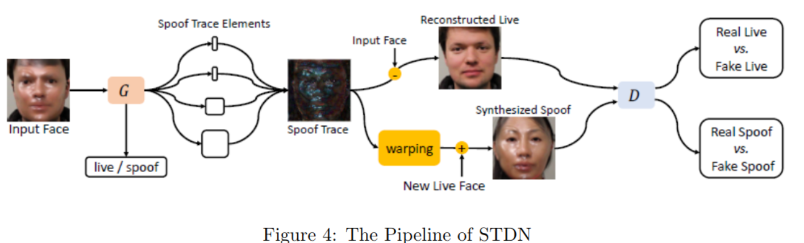

# Mục đích bài báo
Bài báo giới thiệu về các phương pháp nhận diện khuôn mặt bao gồm lịch sử, luồng quy trình (pipeline), các thuật toán thủ công hoặc deep learning, tích hợp với MLops (mainstream training, evaluation datasets) và tích hợp với các ứng dụng liên quan.

**Lưu ý: File md này chỉ là mô tả tổng quan từ pdf. Sau khi đọc file này, nếu có bất kỳ thắc mắc hay muốn tìm hiểu 1 key word nào thì hãy quay lại file pdf. Vì nó có link dẫn đến các bài báo.**
# 1. Introduction
1. FR là 1 trong những lĩnh vực quan trọng nhất của AI nói chung và ComputerVision nói riêng. Hầu như hằng năm các hội nghị hoặc tạp chí lớn như CVPR, ICCV, PAMI đều công bố hàng tá paper liên quan đến lĩnh vực này.

2. Ứng dụng:
    - Unlock thiết bị bằng khuôn mặt
    - Xác thực danh tính trong chuyển khoản và lĩnh vực tài chính
    - Chấm công
    - Xác thực danh tính trong mạng xã hội

3. Mục lục
    - Chapter 2: Lịch sử FR
    - Chapter 3: Giới thiệu 'the pipeline in deep learning framework'
    - Chapter 4: Chi tiết các thuật toán FR bao gồm **loss function, embedding techniques, FR với massive IDs (hệ thống nhiều nhận diện nhiều khuôn mặt), cross-domain, pipeline acceleration, closed-set training, mask face recognition, and privacy-preserving**
        - **massive IDs**: ám chỉ việc hệ thống nhận diện phải xử lý 1 số lượng rất lớn các đối tượng (identities) thường từ hàng trăm nghìn, thậm trí hàng triệu người khác nhau trong cơ sở dữ liệu. Các thách thức bao gồm:
            - Tăng kích thước của không gian nhận diện: khi số lượng danh tính tăng lên, việc tìm ra đúng người rất khó khăn, điều này yêu cầu mô hình phải có khả năng phân biệt chính xác hơn giữa các khuôn mặt có đặc điểm tương tự
            - Hiệu suất tính toán phải nhanh: Khi phải xử lý 1 lượng lớn đối tượng, việc tính toán các đặc trưng và so sánh chúng với các đối tượng khác nhau trở nên rất phức tạp và đòi hỏi nhiều tài nguyên tính toán hơn. Tuy nhiên không vì thế mà ta muốn hệ thống nhận diện chậm đi. Các kỹ thuật tối ưu hóa, tăng tốc quá trình so sánh, hoặc phân cụm danh tính có thể được sử dụng để làm cho hệ thống hoạt động nhanh hơn.
            - Đa dạng dữ liệu: dữ liệu phải đủ lớn
            - Loss function đặc thù phải là ArcFace, CosFace, SphereFace. Những loss func này được phát triển để giúp mô hình deep learning học cách biểu diễn emdedding mạnh mẽ giúp phân biệt tốt các danh  tính ngay cả khi số lượng danh tính là rất lớn
        - **cross-domain**: để cập đến vấn đề mô hình được huấn luyện trên 1 tập dữ liệu cụ thể nhưng sau đó được áp dụng để nhận diện trên 1 miền khác trong lúc test hoặc thực tiễn (có sự khác biệt về đặc điểm dữ liệu). Các yếu tố **domain** có thể bao gồm
            sự khác biệt về nguồn gốc dữ liệu
            sự khác biệt về điều kiện ánh sáng, góc chụp
            sự khác biệt về thiết bị ghi hình: ảnh huấn luyện được thu thập bằng 1 lọai camera có thể khác về chật lượng và chi tiết hình ảnh
            Vấn đề crosss-domain trong nhận diện khuôn mặt thường gây khó khăn vì mô hình deep-learning có xu hướng bị phụ thuộc vào đặc điểm của miền huấn luyện. Nếu  mô hình không được huấn luyện trên dữ liệu đa dạng hoặc không được tối ưu hóa để xử lý tốt trên nhiều miền khác nhau, hiệu suất của nó sẽ giảm khi gặp dữ liệu từ miền mới. Các phương pháp xử lý vấn đề crosss-domain:
                **Domain Adaptation (thích nghi miền)**: Huấn luyện mô hình để nso có thể thích nghi với dữ liệu từ các miền khác nhau
                **Data Augmentation (tăng cường dữ liệu)**: sử dụng các kỹ thuật biến đổi dữ liệu như xoay, thay đổi ánh sáng để tạo ra dữ liệu đa dạng hơn từ tập huấn luyện
                **Transfer Learning**: Sử dụng mô hình đã được huấn luyện trên 1 miền cụ thể và tinh chỉnh lại **(fine-runing)** để mô hình có thể hoạt động tốt trên miền với ít dữ liệu hơn.
        - **pipeline acceleration**: đây là kỹ thuật tăng tốc độ xử lý pipeline trong hệ thống nhận diện khuôn mặt. Pipeline có thể bao gồm các bước từ tiền xử lý dữ liệu, trích xuất các đặc trưng đến việc ra quyến định nhận diện, Việc tăng tốc độ có thể liên quan đến tối ưu hóa thuật toán, sử dụng phần cứng mạnh hơn như (TPU, GPU) hoặc cải tiên các phương pháp xử lý để giảm độ trễ và tăng hiệu suất xử lý trong thời gian thực
        - **closed-set training**: Đây là 1 phương pháp huấn luyện mô hình khi training và test set đều chỉ bao gồm các (IDs) đã biết từ trước. Trong kịch bản 'clossed-set', hệ thống chỉ nhận diện những khuôn mặt đã xuất hiện trong dữ liệu huấn luyện và không cần phải xử lý các khôn mặt lạ (chưa biết). Điều này khác với **open-set recognition**, nơi hệ thống cần có khả năng phát hiện các đối tượng chưa tưng gặp trước đó.
        - **mask face recognition**: đây là công nghệ khi đối tượng đeo khẩu trang, 1 thách thức mới trong dịch COVID-19. Do khẩu trang che 1 phần lớn khuôn mặt, các thuật toán cần phải điều chỉnh để nhận diện chính xác dựa trên các phần khuôn mặ còn lại như mắt, trán và hình dáng tổng thể.
        - **privacy-preserving**: kỹ thuật đảm bảo quyền riêng tư trong quá trình nhận diện khuôn mặt. Ví dụ các phương pháp mã hóa dữ liệu, bảo mật thông tin sinh trắc hoạc, hoặc kỹ thuật federated learning (học liên kết) có thể được áp dụng để bảo vệ dữ liệu cá nhân, đồng thời vẫn cho phép hệ thống hoạt động hiệu quả
    - Chapter 5: Thu thập các experiments (1 khái niệm trong MLops ám chỉ kết quả thu được sau khi train thử nhiệm 1 giải pháp) để tìm ra backbone size tốt nhất và data distribution.
    - Chapter 6: Nói về tần suất sử dụng training và test dataset và so sánh kết quả
    - Chapter 7: Show hệ thống nhận diện khuôn mặt
    - Chapter 8: Giới thiệu các cuộc thi và open source

# 2. History
Những năm gần đây chứng kiến sự bùng nổ mạnh mẹ của FR với deep learning Convolution Neutrual networks kể từ khi mô hình AlexNet ra đời vào năm 2012 khi dành chiến thắng trong cuộc thi ImageNet và bỏ xa các ASOA (a state of art) cùng thời tạo ra sự bùng nổ nghiên cứu về các CNN network trong lĩnh vực thị giác máy tính.

Tuy nhiên trước năm 2014, FR được xử lý theo hướng non-deep learning. Trong phần này ta sẽ giới thiệu về các thuật toán thông thường được thiết kế thủ công đã được sử dụng trong lĩnh vực FR.

1. Eigenface
    Eigenface là phương pháp đầu tiên giải quyết vần đề FR trong computer vision. Nó **reshaped grayscale face image** về 1-D vecctor làm feauture vector của model. Sau đó sử dụng phương pháp PCA (Principal component analysis) - phân tích thành phần chính để tìm 1 không gian con có số chiều thấp nhất sao cho các khuôn mặt có khoảng cách gần nhau nhất (phương sai giữa các khuôn mặt thấp nhất). Khi 1 khuôn mặt mới đến, sẽ thực hiện phép tính khoảng cách Euclid để tính toán khoảng cách của nó với khuôn mặt thấp nhất.
2. Fisherface
    Cải tiến từ Eigenface bằng cách khôi phục 1 hạn chế của PCA. PCA mặc dù mặc dù tối đa hóa phương sai của tất cả các mẫu trong không gian mới mà không xem xét đến sự thay đổi của label.
    Fisherface sử dụng phân tích phân biệt tuyến tính (LDA) để giảm chiều, phương pháp này không chỉ tối ưu hóa sự phân tách giữa các lớp (inter-class variance) mà cong giảm thiểu sự biến thiên trong nội bộ từng lớp (intra-class variance)
    Điều này giúp tăng độ chính xác khi nhận diện khuôn mặt, đặc biệt là khi có sự biến đổi trong ảnh của cùng 1 người.
3. SVM
    Kể từ khi các phương pháp tiền xử lý khuôn mặt phát triển để trích xuất các đặc trưng của khuôn mặt được tách riêng và phát triển để mô hình phân  loại hiệu quả hơn. SVM cũng được đưa vào trong lĩnh vực FR. Rất nhiều các phương pháp dựa trên SVM đã ra đời, mỗi 1 phương pháp gắn với 1 cách tiền xử lý riêng
    Ví dụ: dùng ICA để trích xuất các đặc trưng của khuôn mặt rồi dùng SVM để dự đoán Face ID và để đẩy nhanh quá trình training ICA+SVM có người đã sủa đổi thuật toán thành Least Squares SVM và thu được kết quả tốt hơn
4. LBP (local binary pattern)
    Là 1 trong những bộ trích xuất đặc trưng hình ảnh tốt nhất, LBP thu được cá đặc điểm của hình ảnh thông qua biểu đồ histogram. Nhiều học giả đã đề xuất các thuật toán FR dựa trên LBP feature extractor. (đọc doc)

# 3. Pipelines in deep learnings framework
Khi tài nguyên máy tính mạnh lên theo thời gian cùng sự xuất hiện của alex net với CNN đã tạo ra 1 bước ngoặt cho việc sử dụng deep learning trong vấn đề FR và đã thay thế các phương pháp trích xuất các đặc trưng khuôn mặt thủ công ở trên (feature extraction methods). Phần này cung cấp cho ta 1 cái nhìn tổng quản (pipeline) vể 'training' sử dụng deep learning trong lĩnh vực FR và 'inference' (suy luận) để nhận được ID của face image.

Luồng training FR model gồm 2 bước chính là face images preprocessing và model training (training)
Sau khi có được model, để sử dụng modle dự đoán kết quả cần 3 bước: face images preprocesssing, inference(suy luận) để lấy được face emdedding và recognition (nhận điện) bằng cách matching featured suy luận được từ test image với images đã biết label (model đã train sẽ làm việc này).
Đối với vấn đề face anti-spoofing (chống giả mạo) sẽ được thêm vào trước phần inference trong test pipelines vì các hệ thống FR dễ bị tấn công bằng cách phát lại video, 3d mask, ...  (cả 2 bước tiền xử lý ở trong quá trình training và inference là giống nhau)

## 3.1. Preprocessing (tiền xử lý dữ liệu)
Trong thực tế khuôn mặt thường được đặt trong điều kiện phức tạp như hình ảnh có nhiều người, video cần thực hiện face landmark detection (phát hiện đặc điểm khuôn mặt) và cắt mặt ra.

1. Face detection 
    Face detection hay tự động định vị khuôn mặt. Đây là bài toán lâu đời cổ điển trong lĩnh vưc CV (computer vison). Coi rằng mặt người là đối tượng cần detect, rất nhiều thuật toán deep learning nhận diện face có thể thích ứng với dataset và đưa ra kết quả nhận diện tuyệt vời như là Face-RCNN, SDN, YOLO (với các version 13, 14, 15)
    Tuy nhiên vì tính thực tiễn và tầm quan trọng của Face detect, 1 vài researcher đã coi khuôn mặt là 1 dạng vật thể đặc biệt và tinh chỉnh cho ra các mạng deep neutron đặc biệt có khả năng nhận diện khuôn mặt với  accuacy cao hơn trong thực tế
    
    **Mtcnn** (phương pháp nổi tiếng nhất trong lĩnh vực face-detect trên giảng đường) có kiến trúc là mạng deep learning CNN gồm 3 tầng P-net, R-net, O-net. Nó dự đoán khuôn mặt và trả về vị trí mà khuôn mặt xuất hiện trên image.
        **NMS (non-maximum suppersion) là 1 thuật toán thường được sử dụng trong các hệ thống nhận diện vật thể nói chung và khuôn mặt nói riêng.**
        **Khi các mạng P-net, O-net, R-net trong kiến trúc Mtcnn đưa ra nhiều ứng viên đại diện cho vị trí khuôn mặt (thường có nhiều box bị chồng lên nhau). NMS được sử dụng để loại bỏ các box trùng lặp, chỉ giữ lại hộp có điểm tin cậy cao nhất. Bằng cách này hệ thống sẽ trả về 1 vị trí duy nhất cho mỗi khuôn mặt**

    **Faceness-Net (mặt đeo khẩu trang, bị che khuất 1 phần lớn)**: 1 số reseacher quan sát thấy rằng dựa trên các thuộc tính của khuôn mặt có thể nâng cao hiệu suất phát hiện khuôn mặt trong trường hợp mặt bị che khuất nghiêm trọng (nhu cầu trong dịch covid). Faceness-Net có 2 tầng mạng neutron.
        Stage 1: Mạng chia thành nhiều nhánh để tạo ra các bản đồ phản hồi (response maps) cho các phần khác nhau của khuôn mặt, nhằm phát hiện các đặc điểm cụ thể của khuôn mặt khi bị che
        Stage 2: Tính toán các cứa sổ ứng viên (bounding box) bằng multi-task CNN. 
    
    **FPN (Feature Pyramid Network)**: được sử dụng rộng rãi trong Object detection. Rất nhiều researchers cố gắng mang nó nào lĩnh vực Face Detection và **thành công nhận diện những khuôn mặt nhỏ (tiny face)**
        **SRN (Selective Refinement Network- mạng tinh chỉnh có chọn lọc)**: áp dụng FPN để trích xuất các đặc điểm của khuôn mặt và giới thiệu 2 step để có thể phân loại và hồi quy có chọn lọc vào 1 anchor-bassed face detector để giảm False Positive và cải thiện độ chính xác của vị trí.
            
        Có thể thấy 2 module **STC (Selective Two-step Classification) và STR (Selective Two-step Regression)** của SRN trong hình trên.
        **STC dùng để lọc ra các negative anchor đơn giản ở các layer đầu tiên của mạng** => giảm không gian tìm kiếm cho bộ phân giải triển khai ở các layer sau đó.
        **STR dùng để điều chỉnh vị trí và kích thước của các anchors** để cung cấp tốt hơn cho các layer cao hơn.
    
    **RetinaFace** cũng sử dụng FPN để extract multi-level immage features. Tuy nhiên điều khác biệt so với SRN trong quá trình nhận diện là nó chỉ có 1 stage face detector thực hiện multi-task như
        face score: Tính điểm dự đoán để xác định khả năng có khuôn mặt trong một vùng ảnh cụ thể.
        face box: Xác định khung bao (bounding box) cho khuôn mặt, cho biết vị trí và kích thước của khuôn mặt trong ảnh.
        Facial landmarks: Dự đoán năm điểm đặc trưng trên khuôn mặt (như mắt, mũi, miệng) để định vị các bộ phận quan trọng của khuôn mặt.
        3D face vertices: Dự đoán các đỉnh 3D dày đặc của khuôn mặt, chiếu lên mặt phẳng ảnh, để mô hình có được thông tin sâu hơn về hình dạng khuôn mặt.
    
    Ngày nay
    **CRFace** đề xuất 1 bảng xếp hạng độ tin cậy (confidence rank) để tinh chỉnh kết quả face detection trong hình ảnh và video có độ phân giải cao. Ranker này giúp cải thiện độ chính xác bằng cash sắp xếp độ tin cậy của các khung phát hiện khuôn mặt
    
    **HLA-Face** giải quyết vấn đề phát hiện khuôn mặt trong các tình huống ánh sáng yếu.

    **Với sự phát triển của kỹ thuật nhận diện đối tượng 2D, face detection cũng theo đó mà phát triển và đạt hiệu cao trong các kịch bản thực tế. Do đó các nghiên cứu liên quan đến face detection ngày càng ít xuất hiện trong những năm gần đây.**

2. Face anti-spoofing (Chống giả mạo khuôn mặt)
    Trong công nghiệp, 1 việc quan trọng và cần thiết là việc kiểm tra ảnh trước khi đưa vào model để dự đoán có phải là thật hay không. Nếu không thì rất dễ bị đánh lừa.
    Ví dụ: kẻ tấn công sử dụng video phát lại, ảnh in 2D hoặc mặt nạ 3D. Nếu không có bước này, ảnh sẽ đi trực tiếp vào model để dự đoán.
    Do đó trong bước 'inference' (suy luận), face anti-spoofing là 1 bước tiền xử lý quan trọng sau khi đã thực hiện được face detection khuôn mặt.
    **Các kỹ thuật chống giả mạo khuôn mặt thường được phát triển dựa vào tín hiệu input từ RGB camera.**

    *Phương pháp dựa trên đặc trưng thủcông*: Bao gồm các kỹ thuật trích xuất đặc trưng như LBP, SIFT, SURF và HoG, giúp phân biệt các mẫu giả mạo.
    *Phương pháp học sâu*: 1 số researcher đã thiết kế 1 toán tử tích chập mới (CNN mới) gọi là called Central Difference Convolution - CDNN (tích chập chênh lệch trung tâm) để có được thông tin bất biến chi tiết trong nhiều môi trường khác nhau. Output của feature map có thể được xây dựng như sau
    
    

    - p0 là current location của cả input và output feature map và pn là location của R. 

    **CDNN** sử dụng NAS để tìm kiến trúc tối ưu cho nhiệm vụ chống giả mạo, giám sát bằng 'depth loss' thay vì 'binary loss'.
        NAS (Neural Architecture Search) là một kỹ thuật tự động hóa quá trình tìm kiếm kiến trúc mạng nơ-ron tối ưu cho một nhiệm vụ cụ thể. Thay vì thiết kế thủ công cấu trúc của mạng, NAS sử dụng các thuật toán tìm kiếm để tìm ra kiến trúc mạng phù hợp nhất, thường bằng cách thử nghiệm nhiều cấu hình khác nhau và đánh giá hiệu suất của chúng.
    
    **DCDN:** Cải tiến từ CDCN bằng cách tách các đặc trưng gradient trung tâm thành hai hướng chéo, giúp cải thiện hiệu năng với chi phí tính toán thấp hơn so với CDNN
    
    **STDN (Spatial Transformer Distillation Network)**: Nhận thấy rằng có rất ít lời giải thích về quyết định của bộ phân loại (classifier's decision) Sử dụng học đối kháng để trích xuất các mẫu giúp phân biệt khuôn mặt thật và giả, xử lý các vấn đề thiếu giải thích của các bộ phân loại. Dưới đây là hình STDN.

    

        G-Generator: thành phần duy nhất chiuj trách nhiệm phân tách (disentangle) giữa các yếu tố giả mạo (spoof) và khuôn mặt thật. Từ đây tạo ra 2 đầu ra 
            Spoof Trace Elements: Các yếu tố đặc trưng liên quan đến giả mạo.
            Live/Spoof Classification: Nhãn dự đoán liệu khuôn mặt là "live" (thật) hay "spoof" (giả).
        Spoof Trace Elements & Reconstructed Live: Các yếu tố giả mạo được kết hợp lại để tạo ra một ảnh "Spoof Trace" (đại diện cho các yếu tố giả mạo), trong khi phần khuôn mặt thật được tái tạo lại từ ảnh đầu vào.
        Warping & Synthesized Spoof: Ảnh "Reconstructed Live" và "Spoof Trace" được kết hợp qua một bước "warping" (biến dạng) để tạo ra một ảnh "Synthesized Spoof" – ảnh giả mạo được tổng hợp từ thông tin thật và giả.
        D - Discriminator: Bộ phân biệt này được sử dụng để phân loại ảnh đầu ra thành bốn loại khác nhau:
            Real Live vs. Fake Live: Phân loại giữa khuôn mặt thật và khuôn mặt thật được tạo giả (fake live).
            Real Spoof vs. Fake Spoof: Phân loại giữa khuôn mặt giả mạo thật (real spoof) và khuôn mặt giả mạo được tạo giả (fake spoof).

    **PatchNet**: Định nghĩa chống giả mạo như một bài toán nhận diện vật liệu chi tiết, phân chia loại theo thiết bị và vật liệu trình bày, sử dụng các đầu vào theo từng phần (patch-level) để học các đặc trưng phân biệt, giúp tổng quát hóa tốt hơn.
    
    **SSAN (Style-Selective Anti-Spoofing Network)**: Sử dụng cấu trúc hai luồng để trích xuất đặc trưng về nội dung và phong cách, từ đó tạo ra không gian đặc trưng phong cách để phân biệt khuôn mặt thật và giả. SSAN dùng học đối kháng để chia sẻ thông tin về nội dung và chiến lược học đối ngẫu để tăng cường thông tin liên quan đến liveness.
        **Học đối kháng (adversarial learning): là 1 phương pháp trong học sâu, trong đó hai mạng neutron thường được gọi là mạng sinh (Generator) và mạng phân biệt (Discriminator) được huấn luyện đối kháng với nhau.** Phương pháp này phổ biến trong mạng đối sinh tạo (Generative Adversarial Networks - GANs) và mục tiêu là khiến mạng sinh tạo ra dữ liệu giống thật đến mức mạng phân biệt không thể phân biệt giữa dữ liệu thật và dữ liệu giả. Generator vaf discriminator cạnh tranh nhau trong quá trình huấn luyện. Mạng sinh liên tục cải thiện tạo ra dữ liệu giống thật, mạng phân biệt cố gằng cải thiện khả năng phân biệt. Lợi ích là tạo ra dữ liệu mới và phân biệt chi tiết đối với các bài toán học thật và giả (nó giúp mô hình học được những đặc trưng rất tinh vi, nâng cao khả năng nhận diện và phân loại chính xác)

    **FaceBagNet: Tuy nhiên chỉ sử dụng quang phổ của tín hiệu RGB để chống giả mạo có nhiều hạn chế , do đó ngày càng có nhiều phương pháp dựa trên multi-channel signals để tăng accuaracy.** FaceBagNet sử dụng patch-level image để trích xuất spoof-specific discriminative infomation (thông tin phân biệt giả mạo) và đề xuất 1 chiến lược các feature multi-modal.
        **patch-level**: đây là kỹ thuật chia image thành các mảng nhỏ (patch) và xử lý các mảng này riêng biệt thay vì sử dụng toàn bộ image. Cách tiếp cận này giúp model tập trung vào các khu vực cụ thể của ảnh có thể chứa thông tin giả mạo. Chẳng hạn như các điểm nhỏ bất thường mà khó phát hiện khi nhìn toàn bộ ảnh.
        **Modal(modalities)**: ám chỉ các phương thức (modal) hoặc các feature khác nhau được sử dụng trong model. Ví dụ, trong nhận dạng khuôn mặt, các modal có thể bao gồm các loại dữ liệu khác nhau như ảnh RGB, ảnh hồng ngoại (IR), ảnh độ sâu (depth), hoặc các đặc trưng trích xuất từ các bộ phận khác nhau của khuôn mặt. 

    **CMFL** thiết kế 1 cross-focal loss để điều chỉnh độ quan trọng của từng channel feature, qua đó tận dụng được thông tin bổ sung từ các modal khác nhau để tăng cường khả năng nhận diện giả mạo.

3. Face alignment (căn chỉnh khuôn mặt): giúp cải thiện độ chính xác của model.

    **Face image patch được detect từ các thuật toán hay deep learning model ở bước 1 thường có hình dạng (shape) và góc chụp khác nhau do nhiều yếu tố như tư thế khuôn mặt, biến dạng bối cảnh, ... Những khác biệt này có thể làm giảm hiệu suất của hệ thống nhận diện khuôn mặt vì ảnh của 1 người trông có thể rất khác nhau khi nhìn từ nhiều góc độ. => Các giải pháp Face alignment được sinh ra để giải quyết vấn đề này.**

    Face Alignment là 1 giải pháp hiệu quả để giảm bớt vấn đề trên bằng cách chuyển đổi các face patches (mảng khuôn mặt) dưới 1 angle duy nhất và cùng  1 vị trí đặc biệt là các ảnh có của cùng 1 ID sẽ có sự khác biệt nhỏ hơn sau căn chỉnh, giúp bộ phân loại của mô hình hoạt động hiệu quả hơn.

    **Cách phổ biến để Face Alignment là sử dụng các transformation 2D để hiệu chỉnh các điểm mốc trên khuôn mặt (calibrate) facial landmarks theo các mẫu mặt đã được định trước hoặc vị trí trung bình của tất cả các ảnh. Những phép biến đổi này thường được xử lý bởi các phép affine transformation[33] (đọc [opencv affine transformation](https://www.youtube.com/watch?v=vpa9qKmSrPg&pp=ygUcb3BlbmN2IGFmZmluZSB0cmFuc2Zvcm1hdGlvbg%3D%3D))**

    Đối với các phương pháp căn chỉnh mặt 3D (làm thể nào để đưa ảnh vào 1 mô hình 3D)
        **DeepFace[35]** đề xuất 1 FR pipeline về **triển khai phương pháp căn chỉnh 3D** để Face-aligment các khuôn mặt có sự xoay chuyển ngoài mặt phẳng (out-of-plane rotations) vào không gian 3D. Trong deepface, 1 mô hình 3D tổng quát (generic) cùng với 1 camera affine 3D sẽ được sử dụng để căn chỉnh, biến đôi khuôn mặt trong ảnh 2D vào mặt phăng 3D. Điều này giúp cải thiện độ chính xác trong nhận diện khuôn mặt khi khuôn mặt không hoàn toàn nhìn thẳng vào camera.
            **out-of-plane rotations**: là khi mặt xoay hoặc nghiêng khỏi hướng chính diện như quay đầu sang trái, phải, ... Những trường hợp này tạo ra góc nhìn không chính diện của khuôn mặt. Những trường hợp này sẽ làm cho khuôn mặt bị biến dạng về hình dáng cũng như tỷ lệ, gây ra khó khăn cho các hệ thống nhận diện khuôn mặt truyền thống khi cần xác định định danh danh tính (vì những đặc điểm quen thuộc trên khuôn mặt đã bị thay đổi đáng kể).
            **camera affine 3D** là 1 kỹ thuật để wrap (biến đổi) crop ảnh 2D và đưa nó vào không gian 3D (chính là cái affine transform-giữ lại các tính chất về song song về tỷ lệ khoảng cách các điểm ảnh, ...)
        **Spatial Transform Networks (STN)[36]**: giới thiệu 1 module có thể học được. Module này cho phép các mạng có khả năng tự động thao tác về không gian của ảnh. STN có thể được sử dụng để căn chỉnh ảnh
        **Wu et al.[37]** đã thành công kết hợp căn chỉnh khuôn mặt dựa trên phương pháp STN với face feature extractor (trình trích xuất đặc điểm khuôn mặt) lại với nhau và đưa ra **Recursive Spatial Transformer (ReST)** giúp huấn luyện mô hình FR từ đầu đến cuối kết hợp với căn chỉnh.

    Face aligment với mặt 2D nhanh hơn rất nhiều so với sử dụng 3D aligment sử dụng STN, do đó được sử dụng rộng rãi hơn trong lĩnh vực Face Aligment - preprocessing cho hệ thống FR.
        **APA[38]** đã đề xuất 1 phương pháp căn chỉnh khuôn mặt 2D tổng quát hơn. Thay vì căn chỉnh tất cả dataset về frontal shape (hướng chính diện camera), APA học 1 cách thích ứng nhiều hướng chụp khác nhau => Điều này giúp bảo toàn diện mạo khuôn mặt với ít hiện tượng giả tạo và mất thông tin hơn (bản chất affile transformation là biến đổi ảnh gốc sang 1 ảnh mới, điều này không thể tránh khỏi sẽ có hiện tượng sai lệch thông tin).
    
    **Khi các training set phục vụ hệ thống FR trở lên lớn hơn, đa dạng hơn. 1 số phương pháp FR chọn bỏ qua bước Face Aligments và trực tiếp train và test face patches thu được từ quá trình face detection. Về mặt kỹ thuật, Face Alignments là 1 cách để tăng tính intra-class (đồng nhất) trong cùng 1 class tức các đặc trưng trong dataset của 1 người trở nên tương đồng hơn, dễ phân loại hơn.**
    
    **Với 1 mô hình FR hiện đại được train với nhiều IDs, chúng có thể tự động đạt được phân phối đặc trưng đồng nhất cho từng lớp, làm giảm việc cần thiết của Face Alignments . Do đó quá trình căn chỉnh khuôn mặt có thể không cần thiết ngày nay.**

## 3.2. Training and testing a FR deep model

Sau các bước tiền xử lý ở trên, face images thu được sau cùng có thể được sử dụng để đào tạo mạng học sâu FR. Ngày nay, bất kỳ mainstream backbone (mạng backbone chính thống) nào cũng có thể được sử dụng để xây dựng lên 1 mạng FR. 
**Các backbone khác nhau mà có cùng số lượng parameter cho ra accuracy tương tự nhau với Face Recognition.** Với kết quả này, bạn có thể sử dụng esnet, ResNext, SEResnet, Inception net, Densenet, etc làm backbone. Nếu bạn thiết kế 1 FR system có giới hạn về mặt tài nguyên tính toán thì mobilenet và các biến thể của nó sẽ là sự lựa chọn tốt. Ngoài ra có thể sử dụng NAS có thể được sử dụng để hyper-parameter tốt nhất cho model.

Các thuật toán training sẽ được nói chi tiết ở phần sau. Với mục đích testing, face image sau khi tiền xử lý có thể được đưa vào model FR để lấy face embedding. Phần này liệt kê 1 số thủ thuật thường được sử dụng trong quá trình training.
    **Image augmentation là rất hữu ích, đặc biệt là với các IDs có ít dữ liệu. Các cách tăng cường dữ liệu phổ biến có thể kể đến như thêm noise, blurring (làm mờ), modifying colors (sửa đổi màu sắc). Tuy nhiên đặc biệt tránh random cropping vì nó làm hỏng kết quả Face alignments.**
    Ví Trong quá trình training, flip ảnh được coi là quá trình tăng cường dữ liệu. Trong lúc testing, chúng ta đưa ảnh gốc I và ảnh đã bị flip I' và lấy ra 2 embedding f và f' của ảnh => Mean (trung bình) của 2 embedding là (f+f')/2 có thể được sử dụng là embedding của ảnh I. Trick này có thể cải thiện accaracy của model. 

## 3.3. Face recognition by comparing face embeddings

Bước cuối cùng trong Face inference pipeline là FR bằng cách so sánh các embedding của khuôn mặt (gồm **face verification**- xác thực khuôn mặt và **face identification** - nhận dạng khuôn mặt). Đầu tiên cần phải có Dataset với các ID, trong các ID có thể chứa 1 hoặc nhiều ảnh. Các embedding của từng khuôn mặt sẽ được trích xuất thông qua model FR đã được train và được lưu trong database.
    **Face Verification**:input là image và ID của image, model sẽ đưa ra phán đoán image có thuộc ID đó không => **FV là vấn đề 1:1**. Model sẽ thực hiện extract các feature của I và tính toán độ tương đồng-similarity s(I,ID) của nó với ID's embedding trong database. **s(I,ID) thường được đo bằng cosin nên nó nằm trong khoảng (0,1)**. Nếu s(I,ID) > thershold thì kết quả là true. Nếu s(I,ID) < threshold thì là false.
    **Face Identification - xác thực ID khuôn mặt**, hiển nhiên đây là vấn đề 1:N khác với Face verification. Bạn cần đưa vào image và dataset, output là ID của image dự đoán được. Model sẽ thực hiện extract feature của image và tính toán s(I,ID) với mỗi ID thuộc dataset. Sau đó tìm maximum của tất cả, nếu Maximum này > threshold thì ID của image chính là ID tạo ra giá trị max đó. Ngược lại, nếu maxcimum này < threshold thì image đó chẳng là của ai cả. 
        Phan etal[39] đã làm phong phú thêm quá trình FI này bằng cách thêm vào **Earth Mover’s Distance**.
        Trong phần 4.5 sẽ nói về chi tiết các cách đẩy nhanh quá trình FI.
